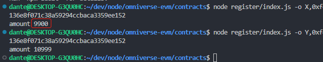
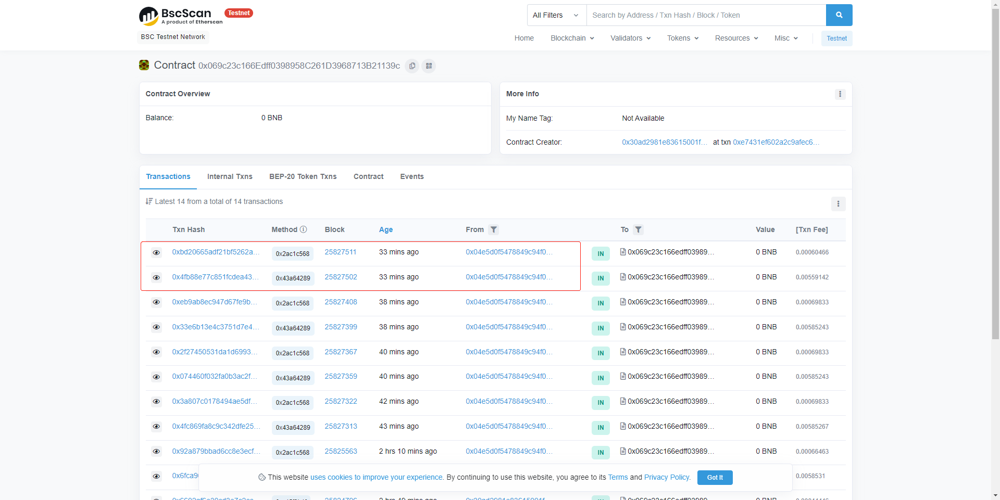
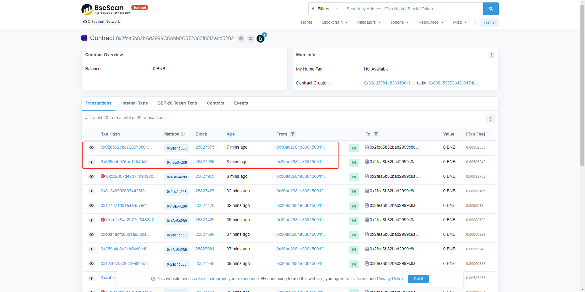

# contracts

## Command line tool
### Install

* Get into this repo `./` first.
* Install node environment. 
```sh
npm install
```

### Usage

Command  
*-o, --omniBalance <token type>,<pk>  Query the balance of the omniverse token*

Query omniverse token amount of X
```
node register/index.js -o X,<OMNIVERSE_ACCOUNT>
```

Query omniverse token amount of Y
```
node register/index.js -o Y,<OMNIVERSE_ACCOUNT>
```

The result will be similar with follows:  
  
  
<p align="center">Figure.1 The balance of Token X and Token Y after swap</p>  

  
  
<p align="center">Figure.2 The balance of Token X of sender and receiver account after transfer</p>  

## Contract addresses

### BSC Testnet

- BSCTEST:
    - Omniverse Token "X": [0x2fea6b82bAd2999C8Abb0C072363f86f2add5292](https://testnet.bscscan.com/address/0x2fea6b82bAd2999C8Abb0C072363f86f2add5292),
    - Omniverse Token "Y": [0x069c23c166Edff0398958C261D3968713B21139c](https://testnet.bscscan.com/address/0x069c23c166Edff0398958C261D3968713B21139c),
